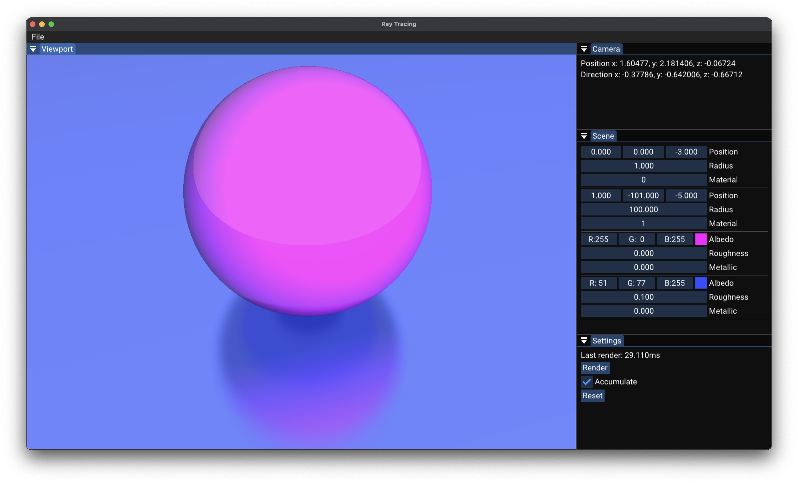

# RayTracing

A real-time ray tracing demo built in C++17 using ImGui, glm, GLFW, and Vulkan, with the help of the Pecan framework as a submodule. This project showcases a simple approach to multi-bounce ray tracing with interactive scene editing, camera movement, and material adjustments.



## Project Description

RayTracing provides an educational playground for understanding fundamental concepts of ray tracing, such as:

- **Multiple bounces**: Rays reflect off objects up to a small, fixed number of bounces. 
- **Material & lighting**: Each sphere has a configurable color (Albedo), Roughness, and Metallic factor, controlling how light reflects. 
- **Camera & UI**: An ImGui interface lets you move the camera, tweak scene objects, and watch changes update in real time. 
- **Parallel acceleration**: Uses C++17’s parallel execution (via `<execution>` and `std::for_each`) to speed up rendering on supported CPUs.

You can explore ray tracing logic without complex shading languages or GPU code—everything is done on the CPU. This makes it easier to modify and experiment with core rendering algorithms.

## Getting Started

### Cloning the Repository

Because **Pecan** is a submodule, clone this repository with:

```shell
git clone --recurse-submodules https://github.com/dasautoooo/RayTracing.git
```

If you’ve already cloned the repo without submodules, you can fetch them separately:

```shell
git submodule update --init --recursive
```

### Dependencies
- C++17 (compiler)
- Pecan (included as a git submodule)
- Vulkan SDK (required by Pecan and for rendering)
- GLFW (windowing and input)
- GLM (math library)
- ImGui (GUI library)

### Building

1. Configure
```shell
mkdir build && cd build
cmake .. -DCMAKE_BUILD_TYPE=Release
```
You can also specify Debug or Dist builds.

2. Compile
```shell
cmake --build .
```
This builds the **RayTracing** executable.

## Usage & Controls

### Camera Movement
- **Right-Click & Drag**: Rotate the camera. 
- **W, A, S, D, Q, E**: Move forward, left, backward, right, down, and up.

### Scene Editing
- **“Scene” Panel**: Displays each sphere’s transform (position, radius) and material index. 
- **“Material” Entries**: Customize Albedo (color), Roughness, and Metallic parameters. 

### Rendering Controls
- **“Accumulate”**: Toggle whether to average samples over frames for smoother results.
- **“Reset”**: Clear the accumulation buffer (useful if you moved the camera or changed scene settings).

### Live Updates
- Any time you move the camera or tweak scene settings, the frame index resets or accumulates as specified, so you can see results in real time.
